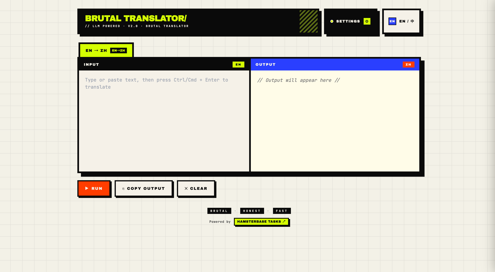

# LLM Translator

[中文](./README.zh-CN.md) | [Online Demo](https://tasks.hamsterbase.com/llm-translator/)

This project is just one prompt. Copy the prompt below into Claude Code or any other LLM to generate the complete app.

## Prompt

```txt
Build a single-file HTML app (Vue 3 + Tailwind via CDN, no build step) — an LLM-powered translator in neobrutalist
style: cream paper background with a black grid, thick 4–6px black borders, hard offset shadows (no border-radius),
accent colors acid-yellow / hot-orange / cobalt / pink, Archivo Black headings + JetBrains Mono body.

Features:
- User configures an OpenAI-compatible API (base URL, key, model, temperature); saved to localStorage.
- Multiple translation templates: name, source lang, target lang, custom prompt using {{text}} / {{source_lang}} /
{{target_lang}}; switch via top tabs. Default = one EN→ZH template (English prompt).
- Two-column workspace: input textarea ↔ streamed output; Ctrl/Cmd+Enter to run; copy / clear buttons.
- Right-side settings drawer with sub-tabs: API config · Templates editor (add/delete/rename, language selects, prompt
editor) · Import/Export (JSON, with or without API key, overwrite/merge on import).
- Bilingual UI (Chinese ↔ English) toggle next to Settings; locale persisted; status indicator (READY/SETUP) with
blinking dot.
```


